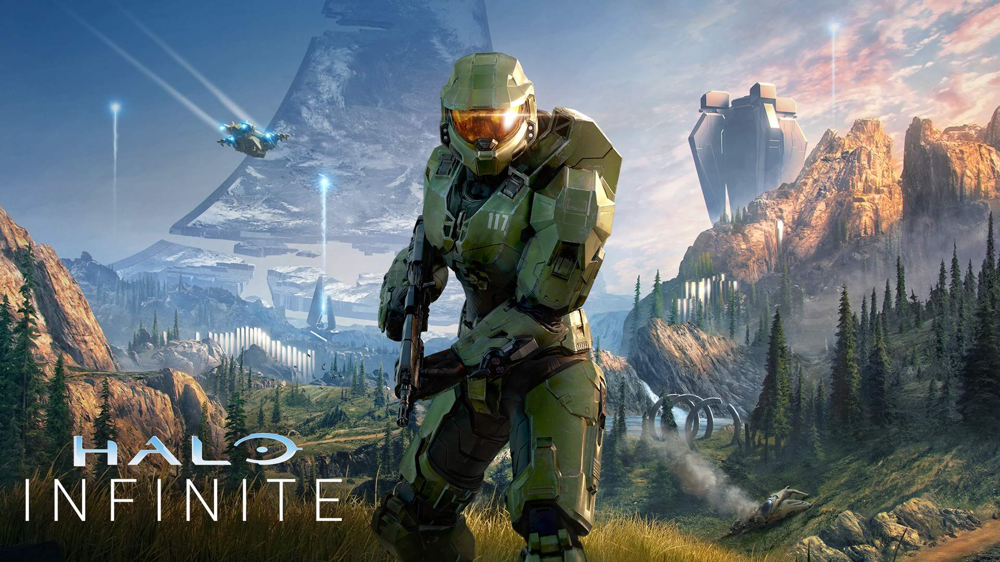
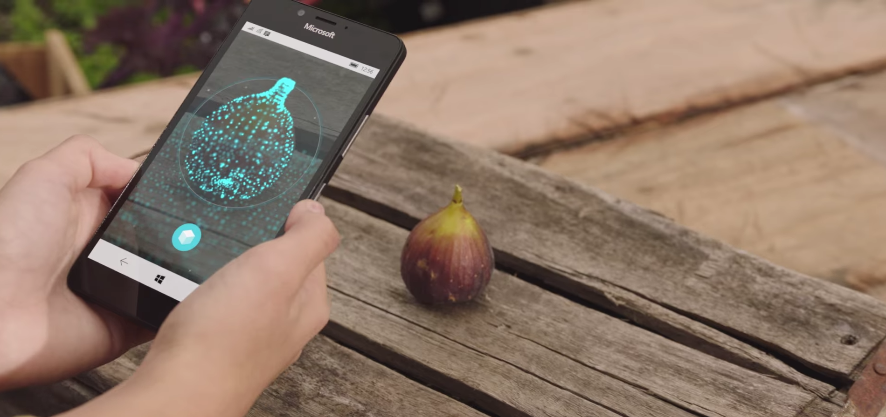
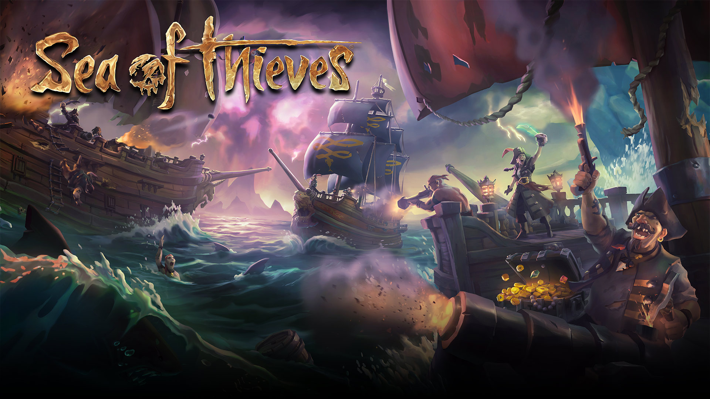
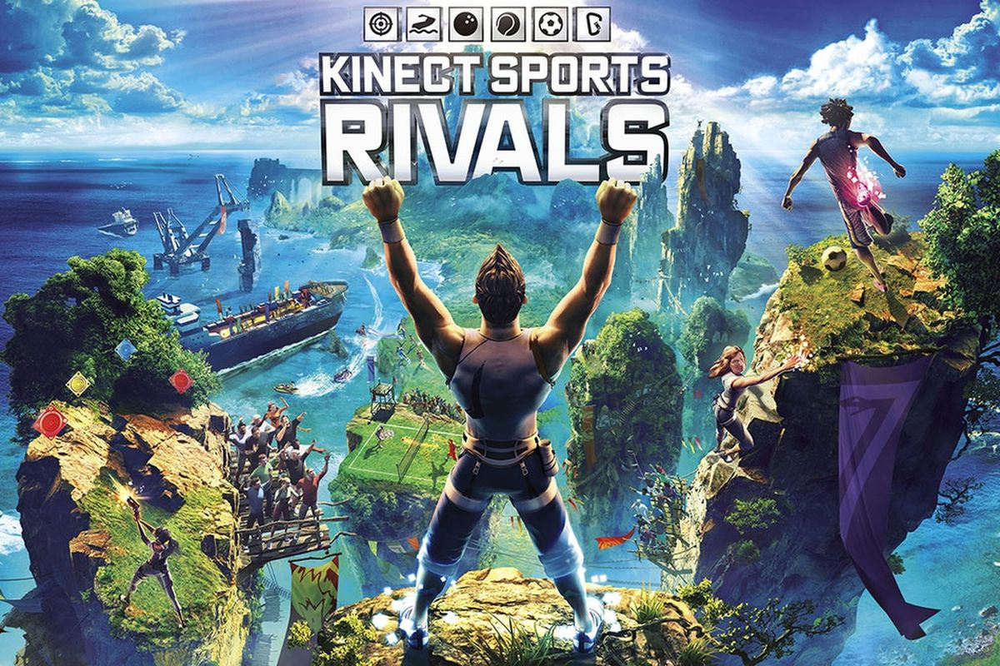
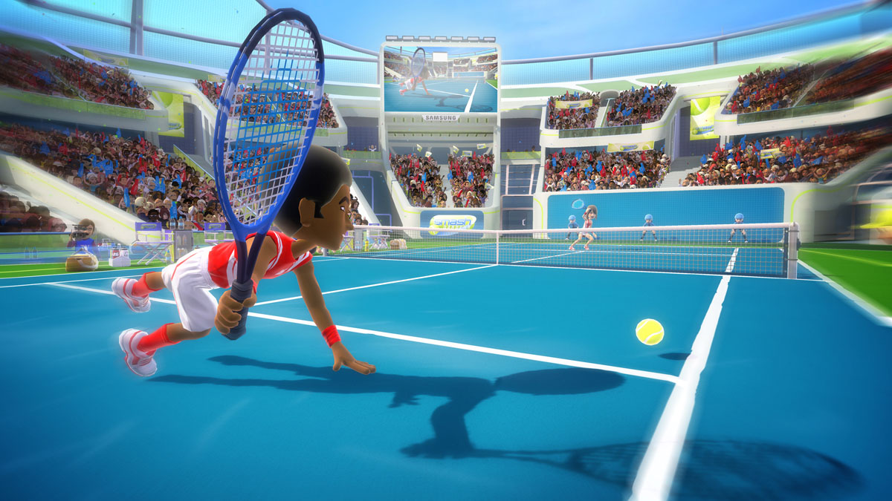
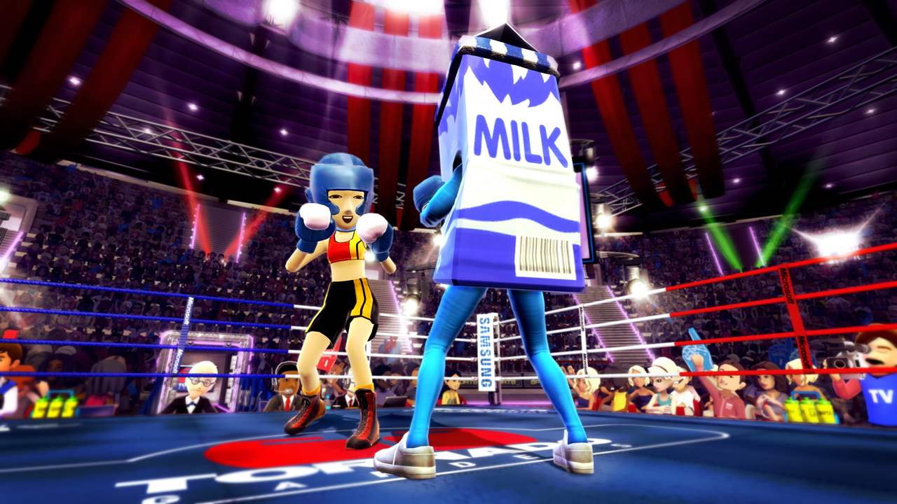
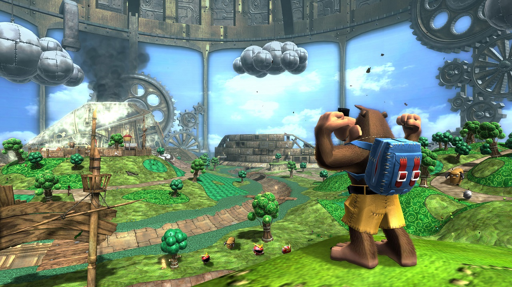

+++
date = '2024-10-20T15:19:53+01:00'
draft = false
title = 'Richard Watson'
+++

I'm Richard Watson, Sim Racer, Game Developer and soon to be participant in the 2025 Caterham Academy. This website has been setup to track my preperation and progress through the Caterham Academy 2025 series as well as act as somewhere for me to dump thoughts about game development. 

# Portfolio

## Halo Infinite - Lead Sandbox Engineer

Halo Infinite is the latest entry in the Halo franchise. As lead of the Engineering Team on Sandbox my team and I are responsible for the following 

* Managing a team of 13 engineers at it's largest including 7 spanning two remote studios
* All Weapon, object, vehicle and player character code 
* All gameplay networking 
* Working effectively with our partner disciplines design, animation, art, effects, audio

## 3D Scanning - Senior Software Engineer

Worked on multiple aspects of a 3d object scanning application capable of generating 3d objects from a monocular or stereo camera feed. Aspects included

* GPU driven image manipulation pipeline
* Camera and IMU recording and deterministic playback
* Performance optimization
* XAML C# UI 

## Sea of Thieves - Senior Gameplay Engineer

Sea of Thieves is an shared world adventure game in which you and a crew of other players play as pirates in an open ended sandbox. As one of the Senior Gameplay Engineers on the project from the beginning I was responsible for

* Managing a team of reports 
* Architecture of all critical game systems 
* Part of the team that pushed for a culture of continuous delivery
* Implementor of multiple systems including character inventory and item wielding system, start game flow, character state management and animation

## Kinect Sports Rivals - Senior Gameplay Engineer

Kinect Sports Rivals is the third Kinect Sports game and the first to utilize the Xbox One Kinect Sensor. As Senior Gameplay Engineer I was responsible for

* Managing a team of reports 
* Implementing core gameplay systems including loading, data flow from and to frontend, player assignment, input management, viewport management, track system for circuit-based events, gameplay state flow, gestures

## Kinect Sports Season 2 - Senior Gameplay Engineer

Kinect Sports Season 2 is the second Kinect Sports game. On this title I was part of the Tennis team, my responsibilities included

* Managing a team of reports 
* Player and AI control, animation, networking and creating and maintaining Kinect gestures for the Tennis game

## Kinect Sports - Gameplay Engineer

Kinect Sports was one of the first Kinect titles. As a gameplay engineer on this project I was responsible for 

* All gameplay aspects of the boxing game, including gestures, character control and locomotion, game flow and logic, AI, cameras, effects, audio and network synchronization. 

## Banjo Kazooie Nuts and Bolts - Gameplay Engineer

Banjo Kazooie Nuts and Bolts is the third Banjo Kazooie game and first on the Xbox 360. As Gameplay Engineer I was responsible for 

* Gameplay objects, object interaction, challenge gameplay logic and flow and AI for certain characters in the game world. 

