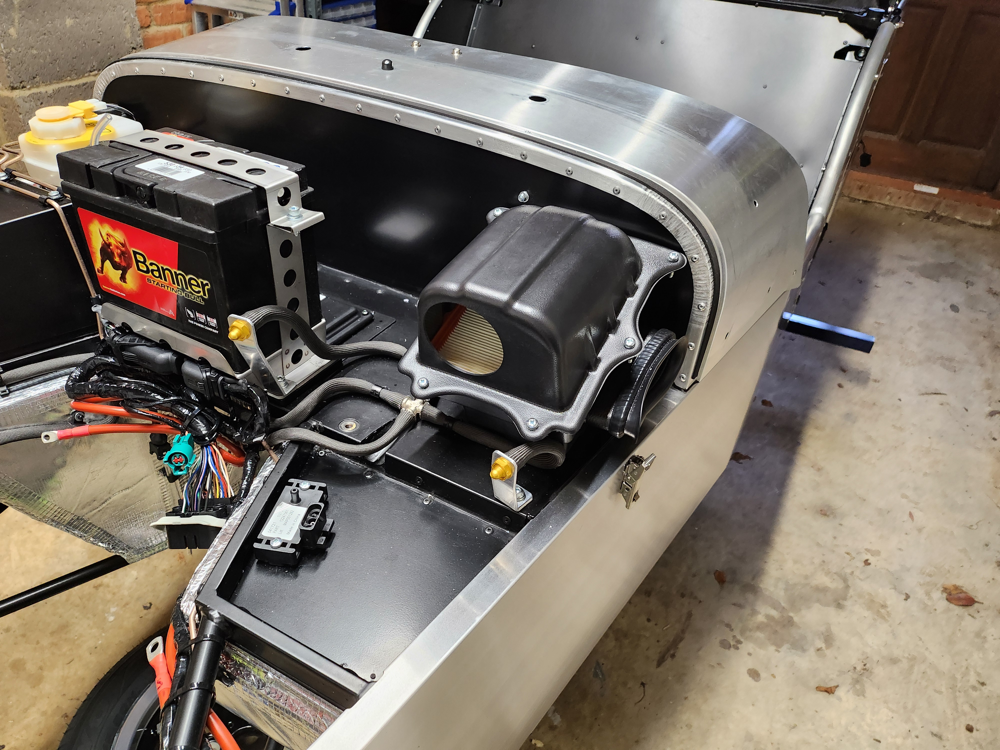

+++
date = '2024-10-27T19:41:31+01:00'
title = 'Day 5: Wrap Prep'
tags = ['caterham', 'build diary']
+++

Unfortunately this week has been quite hectic and I haven't managed to get as much work done on the car as I had originally hoped. 

I am getting the car wrapped next week so the bulk of the work has been removing the windscreen, the rear lights and lowering the washer motors clear of the scuttle. 



By far the most fiddly part of the work was the washer motors. They are attached on the passenger side on a special mounting plate via two bolts. This is quite fiddly to get to but I managed to get there in the end. 

As the car is getting wrapped I haven't started as the manual suggests on the front suspension setup to give the wrapper an easier time. I wrapped up the day by installing the steering rack and the airbox. These were both relatively easy jobs except for the universal joint on the steering arm being slightly different to the manual. I've emailed Caterham about this so hopefully I get an answer tomorrow. The other thing that was slightly tricky was trimming the IVA cover for the steering rack. I made a bit of a hash of it if I'm being honest. I may try and give it a quick tidy up tomorrow. 

 

 

Next job is building up the headlight assembly. I've heard this is one of the more awkward jobs so I'm looking forward to getting it done! 
